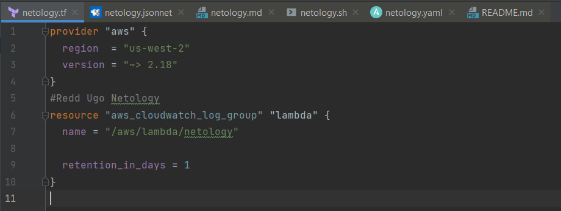
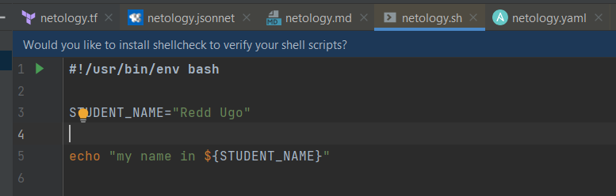
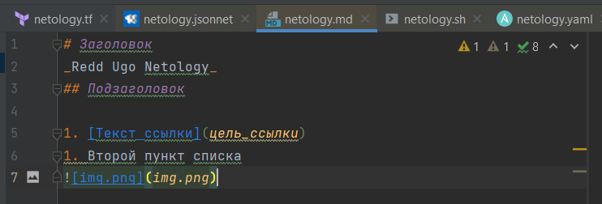
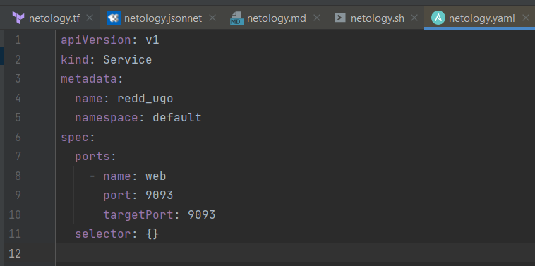
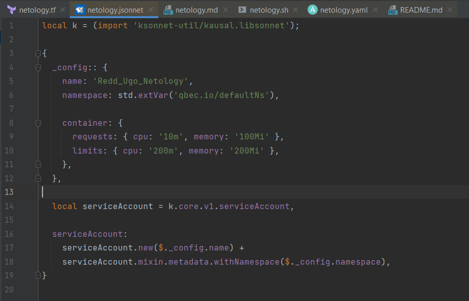

# Домашнее задание к занятию «Введение в DevOps»

### Ответы

----     
     
## Задание 1. Подготовка рабочей среды

* Terraform: 
* Bash: 
* Markdown: 
* Yaml: 
* Jsonnet: 

----

## Задание 2. Описание жизненного цикла задачи (разработки нового функционала)

Чтобы лучше понимать предназначение инструментов, с которыми вам предстоит работать, составим схему жизненного цикла задачи в идеальном для вас случае.

### Описание истории

Представьте, что вы работаете в стартапе, который запустил интернет-магазин. Он достаточно успешно развивался, и пришло время налаживать процессы: у вас стало больше конечных клиентов, менеджеров и разработчиков.

Сейчас от клиентов вам приходят задачи, связанные с разработкой нового функционала. Задач много, и все они требуют выкладки на тестовые среды, одобрения тестировщика, проверки менеджером перед показом клиенту. В некоторых случаях вам будет необходим откат изменений. 

### Решение задачи

Вам нужно описать процесс решения задачи в соответствии с жизненным циклом разработки программного обеспечения. Использование конкретного метода разработки необязательно. 

Для решения главное — прописать по пунктам шаги решения задачи (релизации в конечный результат) с участием менеджера, разработчика (или команды разработчиков), тестировщика (или команды тестировщиков) и себя как DevOps-инженера. 

1. Планирование

Совместно с менеджером (менеджерами) составить список изменений, которые будут внедрятся в интернет-магазин на этом цикле разработки. Моя роль будет заключаться в том, чтобы план изменений был реальным. 

2. Разработка

Совместно с разработчиком (разработчиками) определиться со средой реализации изменений, наметить схему тестирования, определить ответственных за код-ревью. Также моей ответственностью будет создание среды разработки, настройка версионности, бэкапов и восстановления. 

3. Тестирование

Совместно с QA создать многоступенчатое тестирование от юнит-тестов и выше, создать и поддерживать автоматизированную среду тестирования, обеспечивать свежие копии БД, обратную связь с разработчиками.

4. Релиз и Развёртывание

Моя задача поддерживать или разворачивать необходимую среду функционирования, в случае необходимости увеличить ресурсы инфраструктуры,обеспечить соблюдение версионности, резервирование и восстановление 

6. Эксплуатация и мониторинг

Моя задача обеспечивать постоянный мониторинг оборудования, среды, обеспечивать постоянную доступность сервисов, заранее находить узкие места и предпринимать действия по их устранению.

